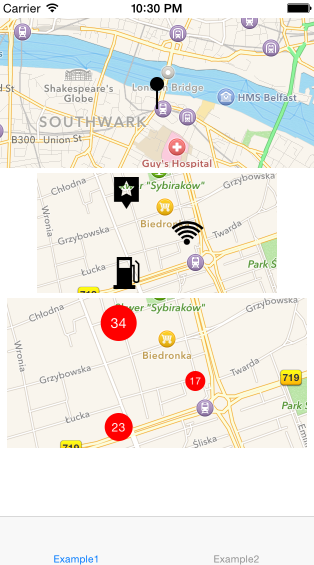
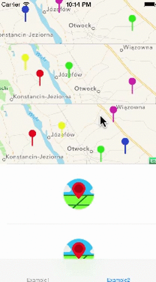
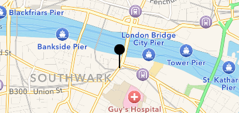

# BGMapPreview for iOS

[](http://cocoapods.org/pods/BGMapPreview)
[](http://cocoapods.org/pods/BGMapPreview)
[](http://cocoapods.org/pods/BGMapPreview)

## BGMapPreview is a category on UIImageView for iOS to create and set map preview image asynchronously.





## Features:
* Creates customized map previews within a few lines of code
* Built on top of MKMapView
* Built-in caching for better performance
* Built-in operation cancellation for better UX (ex. reusable objects)
* Compatible with iOS 8, 9, 10

## Installation

BGMapPreview is available through [CocoaPods](http://cocoapods.org). To install
it, simply add the following line to your Podfile:

```ruby
pod "BGMapPreview"
```

## How To Set Map Preview with Single Pin?

1) ``` #import <BGMapPreview/UIImageView+BGMapPreview.h> ```

2) Initialize and configure object of BGLocationDescriptor class.
```objective-c
BGLocationDescriptor *locationDescriptor = [BGLocationDescriptor new];
locationDescriptor.location = [[CLLocation alloc] initWithLatitude:51.5057879f 
longitude:-0.0887631f];

UIImageView *annotationView = [[UIImageView alloc] initWithFrame:CGRectMake(0, 0, 32.f, 32.f)];
annotationView.image = [UIImage imageNamed:@"pin1"];
locationDescriptor.annotationView = annotationView;
``` 

3) Execute map preview.
```objective-c
[self.imageView setPreviewWithLocationDescriptor:locationDescriptor]
```


## More Options

* Pass in an *array* of location descriptors to get map preview with multiple locations. The final image will consider all points to provide best possible output.
```objective-c
- (void)setPreviewWithLocationDescriptors:(NSArray *)descriptors;
```

* Provide *placeholder* image for the time map preview is being created.
```objective-c
- (void)setPreviewWithLocationDescriptors:(NSArray *)descriptors
placeholder:(UIImage *)placeholder;
```
* If you use *autolayout* and your image view size is not final at the moment you start map preview creation, pass in *imageSize* parameter to explicitly define its size.
```objective-c
- (void)setPreviewWithLocationDescriptors:(NSArray *)descriptors
placeholder:(UIImage *)placeholder
imageSize:(CGSize)imageSize;
```
* Configure location descriptor for *anchor point* depend on your annotation view. By default it is horizontally centered and vertically bottom.

* Subclass BGLocationDescriptor and override - (void)keyCache to provide *tailor-made map preview caching*. By default it creates cache key based on locations.

## Usage

To run the example project, clone the repo, and run example target.


## Authors

* Bartlomiej Guminiak, guminiak.bartlomiej@gmail.com
* Konrad Szczęśniak, https://github.com/koszcz

## License

BGMapPreview is available under the MIT license. See the LICENSE file for more info.
